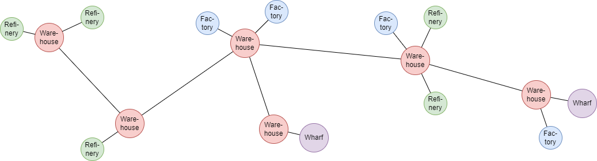

# X4 Foundations - Warehouse Fleets Mod

This mod was inspired by the popular [Mules and Warehouses Mod](https://github.com/Misunderstood-Wookiee/Mules-and-Warehouses-Extended) and aims to combine the different mule types into one.

It introduces the WarehouseFleet behaviour, which serves the following purposes:
- Balance cargo levels between warehouses
- Fetch products from factories
- Supply factories with resources
- Sell products to NPC factions
- Fill shortages by buying from NPC factions
- Supply player-owned build storages

*Disclaimer: this is my first X4 mod and it isn't fully tested yet, so use at your own risk - I'll gladly help if you stumble over any problems though. Once it is properly tested, I will probably publish it on Steam and Nexus.*

## Intended Use

The mod allows to create a network of warehouses across the galaxy, which will ultimately behave like a single giant shared storage. Arbitrary refineries and factories can be built along this network and will feed from its resources and provide their own products back into the network.

To make this work, every warehouse gets assigned a "WarehouseFleet", composed of a commander ship that uses the WarehouseFleet behaviour and a set of subordinates set to mimic the commander behavior.

## WarehouseFleet Parameters

| Parameter | Description |
| --- | --- |
| Home Warehouse | The home warehouse of this fleet. |
| Adjacent Warehouses | Directly connected other warehouses. The fleet will fetch/deliver wares to balance storage levels between warehouses. |
| Service Area | A list of sectors or stations. Specifies the area of operation, i.e. which player factories to include in the network and also which NPC stations to trade with. |
| Blacklist (M) | A list of sectors or stations to avoid with M-class ships. Can be used to avoid high-risk areas. |
| Blacklist (L) | A list of sectors or stations to avoid with L-class ships. Can be used to avoid scheduling too short trips for freighters. |
| Min. Cargo Usage (%) | Avoids scheduling inefficient trips. No ship will be scheduled that uses less than the specified cargo space. Setting this value too high might prevent/delay balancing of low volume wares though. |
| Prio: Distribute | Set to high values to generally favor ware distribution over other tasks. |
| Prio: Supply Build Storage | Set to high values to generally favor supplying build storages over other tasks. |
| Prio: Trade  | Set to high values to generally favor trading over other tasks. |
| Trades: Storage &lt;-&gt; Profit | When checking trade options, determines if we should maximize profit or try to resolve situations of full storages or shortages.  |
| Trades: Gate Penalty (%) | Reduces the attractivity of trades in other sectors to keep travel distances short. |
| Account Threshold | Buying wares from NPC stations will only be allowed if it leaves the player account with more money than this setting. This setting will be synchronized between all WarehouseFleets! |

## Warehouses, Trade Wares and Restrictions

The mod uses the normal trade mechanics of the game. So the ships will only be able to transport wares if there are corresponding trade offers set up and their restriction settings are set up appropriately.

The WarehouseFleet ships will also respect buy/sell restrictions to other factions (which is usually not the case in the base game). This is used to control which wares to trade with other factions.

The general setup works like this:
- Create a trade blacklist restricting all trades to only your own faction and set it as default for all your stations
- Add all relevant trade wares in your warehouses (via the station logical overview)
  - Add buy and sell offers (those will inherit the default trade restriction you set up earlier)
  - Set a sell offer to unrestricted to allow your traders to sell off the ware (usually your end products)
  - Set a buy offer to unrestricted to allow your traders to buy the ware from NPC stations (usually the wares you frequently run into shortages)

Be cautious with unrestricted buy offers. Those can drain your account. Use the account threshold setting to control it if necessary.

## Budgets and Money

The player-owned stations don't need any budgets for this mod to work. All trades with NPC factions use the global player account. (I tried to make it work with station accounts, but unfortunately this isn't possible without commander-assignment and this in turn locks the fleet settings so they cannot be changed afterwards - which would be a huge drawback).

If a warehouse has unrestricted sell offers, NPC traders can also buy directly from your warehouse. If this happens, the money goes to the station account. Check those accounts from time to time.
In future versions of the mod I might automate this.

## Notes

- Idle ships will dock at their home warehouse and wait for something to do.
- Ships will always begin and end their tasks at the home warehouse. A ship will fly back to the warehouse, even if it has nothing to carry and could in theory fly directly to another station. This is intentional, so that the routes are easier to control and protect. If shortcutting was allowed, the pathing could become unpredictable and ships might fly through hostile regions.
- S class ships will not use the service area setting and instead only operate in the local sector. They are generally very inefficient when it comes to longer flights and to cut down on settings, this behavior is hardcoded.
- Ships will only consider a trade if it is profitable. This means they will only sell a ware if your sell offer is cheaper than the buy offer of an NPC station and they will only buy a ware if your buy offer is higher than the sell offer of an NPC station. Usually, you want to set automatic pricing, so your ships will only buy/sell wares if the offer is profitable considering the current market price.

## Some Implementation Details

- To avoid "ping-ponging" of wares, I have implemented two mechanisms:
  - When balancing wares, the cargo will be limited to an amount that perfectly balances the storage levels in both warehouses.
  - Every delivery reduces the attractivity of delivering the same ware in the opposite direction. This effect will decrease over time.
- The base game seems to have a bug causing ships to undock when evaluating modded behaviors. To circumvent unnecessary undock procedures, most of the mod is implemented as a cue instead of an aiscript, so essentially a persistent background process in the game.

## Known Problems

- When selecting the service area of a fleet, the game UI sometimes crashes and resets itself. I have no idea why this happens. Seems to be a bug in the game. It is recommended to save before editing this parameter.
- When creating a new WarehouseFleet, the account threshold parameter is initalized with a default value. Remember to always adjust this value before saving, because it will be synced to all other fleets.
- Setting up the trades of the warehouses is a bit tedious at the moment, because it has to be done one by one in each warehouse. I don't know if there is a good solution to this problem.
